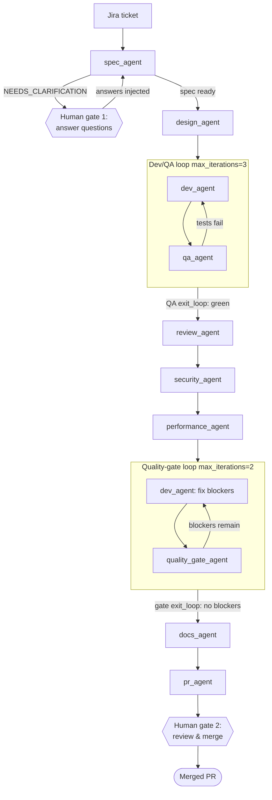
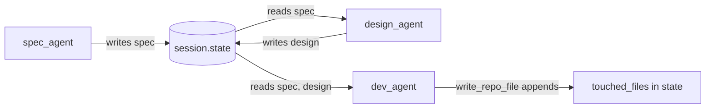
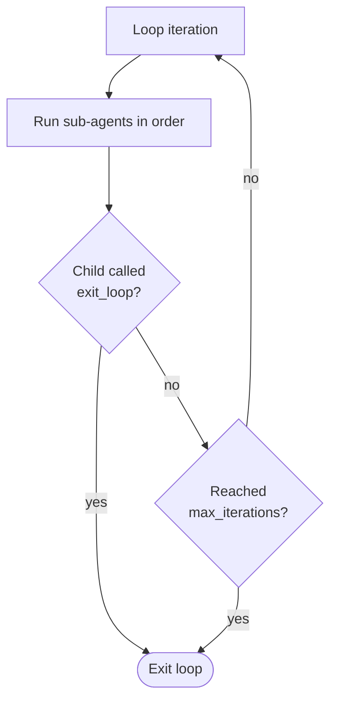
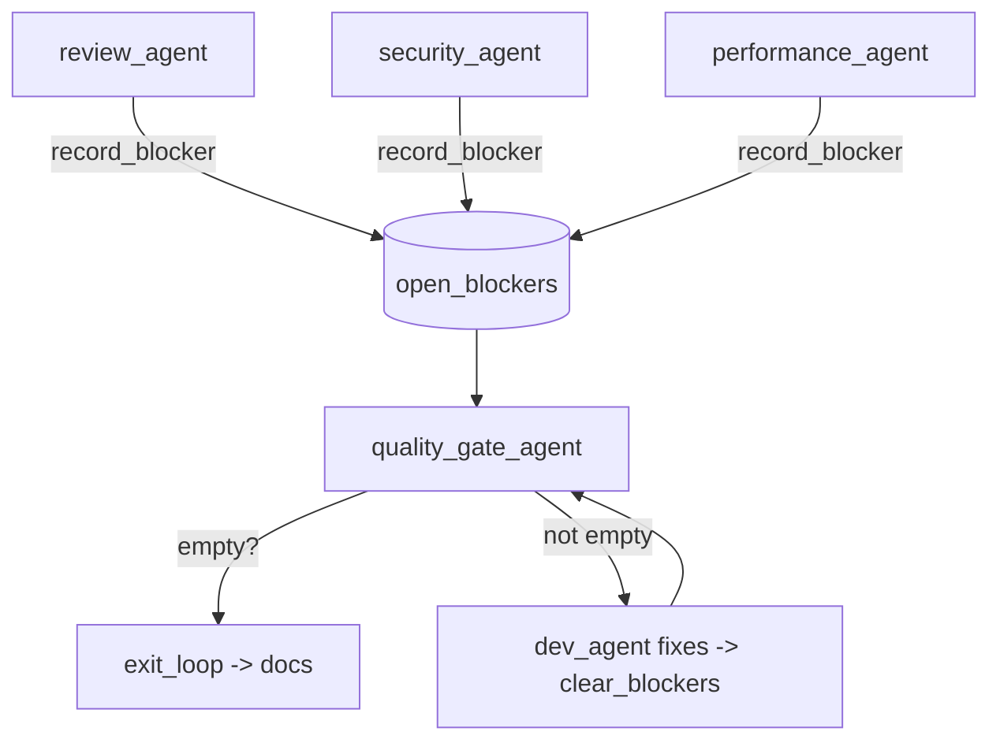

# Pipeline flow

This file describes the runtime flow. The diagrams use [Mermaid](https://mermaid.js.org/),
which renders natively on GitHub/GitLab and most Markdown viewers.

## End-to-end flow

## How a stage hands off to the next

Every stage writes one `output_key` into shared `session.state`; the next stage
reads it by name. No files are passed between agents — the session is the
artifact store.

## Loop termination

A `LoopAgent` stops when a child sets `escalate=True` (via the `exit_loop` tool)
**or** `max_iterations` is reached.

## Blocker routing

Review, Security, and Performance do not loop individually. They record
blockers into shared state; a single quality-gate loop afterward fixes and
re-checks them. This avoids three independent loops contending over the Dev
agent.

## Textual sequence (no rendering required)

1. Driver seeds `session.state` with `jira_ticket`.
2. **Run 1** executes `spec_agent`.
   - If output starts with `NEEDS_CLARIFICATION:` → stop, return questions
     (**human gate 1**). Human answers → inject `clarification_answers` → re-run.
   - Else continue.
3. **Run 2** executes the `build_pipeline` `SequentialAgent`:
   1. `design_agent` reads conventions + sibling code, writes `design`.
   2. **Dev/QA loop** until QA `exit_loop` or 3 iterations.
   3. `review_agent`, then `security_agent`, then `performance_agent` —
      each may `record_blocker`.
   4. **Quality-gate loop** until gate `exit_loop` or 2 iterations.
   5. `docs_agent` updates documentation.
   6. `pr_agent` assembles the PR draft and stops (**human gate 2**).
4. A human reviews and merges.
